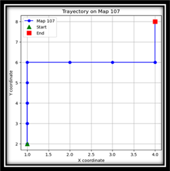

# 🎮 RL Agent for Medarot – Deep Reinforcement Learning with PyBoy

## ✨ Overview

**RL Medarot** is a Deep Reinforcement Learning project where an agent learns to play  
**Medarot Kabuto (Game Boy)** using:

- 🕹️ [PyBoy](https://github.com/Baekalfen/PyBoy) for Game Boy emulation  
- 🧩 [Gymnasium](https://gymnasium.farama.org/) for the RL environment  
- 🤖 [Stable-Baselines3](https://stable-baselines3.readthedocs.io/) for PPO and A2C algorithms  

The goal is to train an agent that explores the world, interacts with NPCs, and wins battles while maximizing total reward.

## 📸 Screenshots

| Second Map (Home Living Room)             | Agent Path on Second Map |
|-------------------------------------------|--------------------------|
|  |  ||

## 📂 Project Structure

RLMEDA/
- data/ # ROM and state files (not versioned)
- env/ # Custom Gym environment (GenericPyBoyEnv)
- evaluation/ # Evaluation & trajectory visualization
- logs/ # Tensorboard logs
- notebooks/ # Jupyter notebooks for quick experiments
- training/ # PPO / A2C training scripts
- models/ # Trained models (gitignored)
- docs # Multimedia (gitignored)
- requirements.txt
- README.md

## 🛠️ Requirements

- Python 3.9+

pip install -r requirements.txt

Contents of requirements.txt:
- pyboy
- gymnasium
- stable-baselines3
- matplotlib
- numpy
- seaborn

## 🚀 Quick Start
### 1️⃣ Training

- Train the agent with **PPO**: python training/train_ppo.py

- Train the agent with **A2C**: python training/train_a2c.py

Models are saved in models/.

### 2️⃣ Evaluation

- **Evaluate** a trained model and compute mean reward: python evaluation/evaluate_model.py

- Visualize the agent’s **trajectory**: python evaluation/visualize_trajectory.py

## ⚙️ Technical Details

- **Action Space**: ['a', 'b', 'left', 'right', 'up', 'down']

- **Observation**: Player (x, y) coordinates, current map ID, and facing direction

- **Reward Scheme**:

- ➕ 1 Point for discovering a new map tile

- ➕ 10 Points for reaching a goal location

- ➖ 0.001 Points per step to encourage faster completion

## 📝 Notes

Place the **ROM** MedarotKabuto.gb and the initial save zero_state.state inside data/ before training.

- **Hyperparameters** (learning rate, gamma, etc.) can be tuned in the scripts under training/.

## 👨‍💻 Author

**Ian Pardo García**

## 📜 License

The game ROM is not included due to copyright; add it manually in the data/ folder.

## 🎯 Explore, train, and have fun with RL Medarot!

